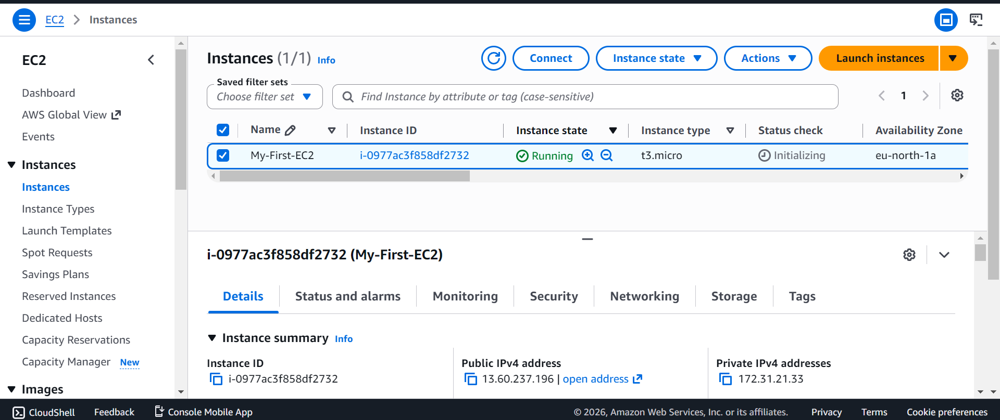
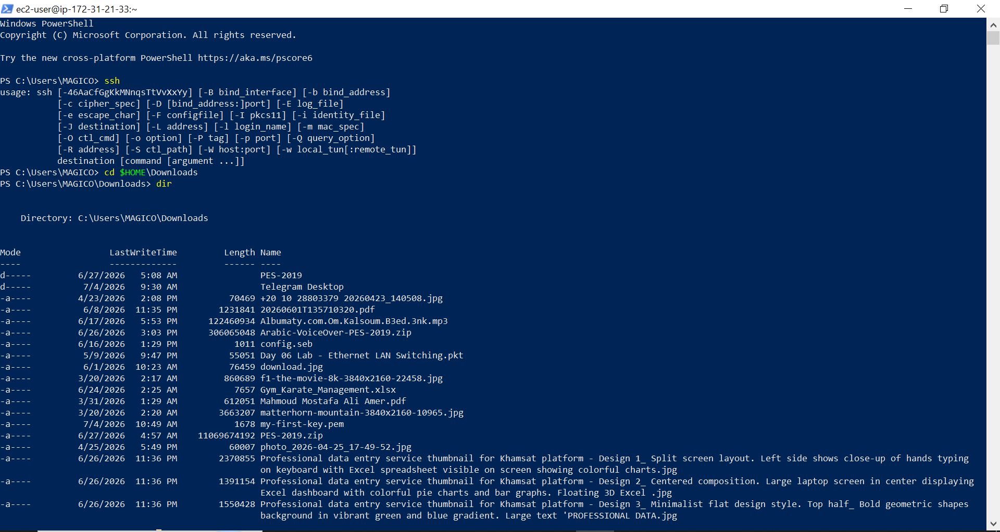

# AWS EC2 First Lab

## Overview
This project demonstrates the process of launching and connecting to an Amazon EC2 instance.

## Services Used
- Amazon EC2
- Security Groups
- SSH
- Amazon Linux 2023

## Steps
1. Launched an EC2 instance.
2. Selected Amazon Linux 2023 AMI.
3. Chose t3.micro instance type.
4. Created an SSH Key Pair.
5. Configured a Security Group to allow SSH access.
6. Connected to the instance using SSH from Windows PowerShell.
7. Verified successful remote access.

8. ## EC2 Instance Running

## SSH Connection

## Skills Learned
- EC2
- SSH
- Security Groups
- Key Pairs
- Linux Basics
